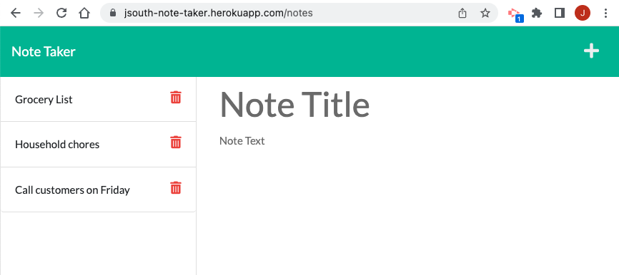

# NoteTaker

## Table of Content
- [Description](#description)
- [Usage Information](#usage)
- [License](#license)
- [Contributor](#contributor)
- [Contact Information](#contact)

## Description

This app is a simple design for users to write, save, and delete notes.   

## Usage

Click on the following link to deploy this app 
<a href="https://jsouth-note-taker.herokuapp.com/" title="NoteTaker_app">Note Taker</a>

## License

[ISC](https://choosealicense.com/licenses/isc/) license

## Contributor

Jason South is the primary contributor

## Contact
Jason South  
GitHub username: jsouth75  
Email: jason.south@me.com

